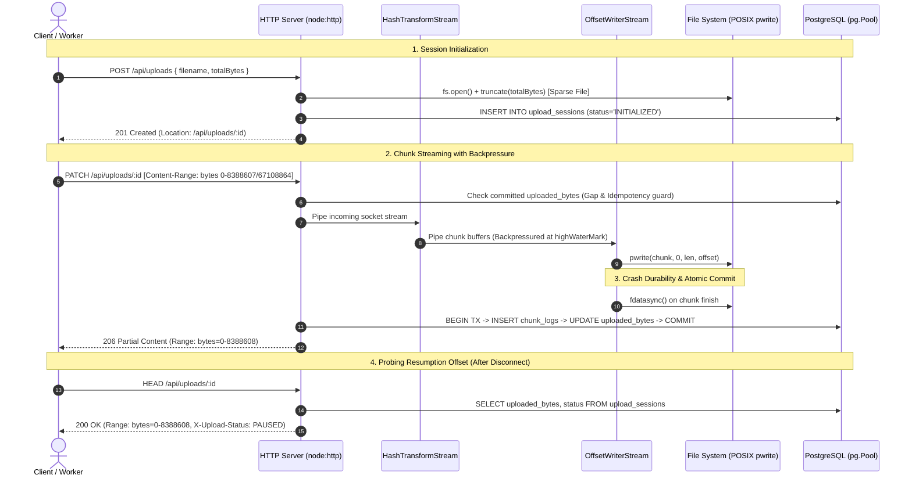

# Resumable File Streaming Engine with Backpressure

[](https://nodejs.org/)
[](https://www.postgresql.org/)
[](https://datatracker.ietf.org/doc/html/rfc7233)
[](LICENSE)

A high-performance, memory-bounded streaming engine built in Node.js designed to handle multi-gigabyte file uploads and downloads (10GB+) over HTTP without Out-Of-Memory (OOM) crashes.

---

## Key Highlights & Systems Architecture

- **Bounded Memory Invariant**: Consistently operates with `< 25MB` V8 Heap allocations regardless of multi-gigabyte upload sizes, enforced via Node.js stream backpressure and configurable `highWaterMark` windows.
- **Sparse File Allocation (O(1) in < 1ms)**: Pre-allocates target file space using POSIX `truncate` immediately upon session creation, eliminating runtime disk fragmentation and avoiding zero-filling latency (ADR-0002).
- **POSIX `pwrite` Offset Writing**: Bypasses sequential write pointers and concurrent race conditions by writing chunks directly to disk at designated byte coordinates (`FileHandle.write(chunk, 0, len, offset)`) (ADR-0004).
- **Zero-Memory Cryptographic Hasher**: Incremental SHA-256 `Transform` stream computes running checksums on-the-fly without accumulating buffers in memory, preventing downstream buffer pollution (ADR-0003).
- **Crash Durability & Atomic Resumption**: Disk flushes via POSIX `fdatasync` (`FileHandle.sync()`) paired with atomic PostgreSQL transactions guarantee that committed byte offsets always match physical disk state (ADR-0005).
- **RFC 7233 Protocol Conformance**: Standard HTTP `Content-Range` chunked `PATCH` uploads, `HEAD` offset probe discovery, and `Range` multi-part download streaming.
- **Active Lifecycle Management**: Native `AbortController` integration cleans up sockets, tears down stream pipelines, releases file descriptors, and marks sessions `PAUSED` upon network disconnections (ADR-0006).

---

## Architectural Data Flow



---

## Protocol Specification (RFC 7233)

### 1. Initialize Upload Session
- **Endpoint**: `POST /api/uploads`
- **Request Body**:
  ```json
  {
    "filename": "firmware-archive.tar.gz",
    "totalBytes": 1073741824
  }
  ```
- **Response**: `201 Created`
  - `Location`: `/api/uploads/7f940b54-f5a6-42d4-a1db-f21503ba6930`
  ```json
  {
    "id": "7f940b54-f5a6-42d4-a1db-f21503ba6930",
    "filename": "firmware-archive.tar.gz",
    "totalBytes": 1073741824,
    "uploadedBytes": 0,
    "status": "INITIALIZED",
    "createdAt": "2026-09-16T02:00:00.000Z"
  }
  ```

### 2. Upload Chunk
- **Endpoint**: `PATCH /api/uploads/:id`
- **Headers**:
  - `Content-Type`: `application/octet-stream`
  - `Content-Range`: `bytes 0-8388607/1073741824`
  - `X-Chunk-SHA256`: `<hex-digest>` *(optional, verified on-the-fly)*
- **Response (Partial)**: `206 Partial Content`
  - `Range`: `bytes=0-8388608`
  ```json
  {
    "status": "UPLOADING",
    "uploadedBytes": 8388608,
    "totalBytes": 1073741824,
    "chunkBytesWritten": 8388608
  }
  ```
- **Response (Completion)**: `200 OK`
  ```json
  {
    "status": "COMPLETED",
    "uploadedBytes": 1073741824,
    "totalBytes": 1073741824,
    "finalSha256": "4b227777d4dd1fc61c6f884f48641d02b4d121d3fd328cb08b5531fcacdabf8a"
  }
  ```

### 3. Probe Resumption State
- **Endpoint**: `HEAD /api/uploads/:id`
- **Response**: `200 OK`
  - `Range`: `bytes=0-8388608`
  - `X-Upload-Status`: `UPLOADING` | `PAUSED` | `COMPLETED`
  - `X-Uploaded-Bytes`: `8388608`
  - `X-Total-Bytes`: `1073741824`
  - `Accept-Ranges`: `bytes`

### 4. Download File with Range Support
- **Endpoint**: `GET /api/downloads/:id`
- **Headers**:
  - `Range`: `bytes=0-1048575` *(first 1MB)*, `bytes=1048576-` *(from 1MB to EOF)*, or `bytes=-524288` *(last 512KB)*
- **Response**: `206 Partial Content` (or `200 OK` for entire file)
  - `Content-Range`: `bytes 0-1048575/1073741824`
  - `Accept-Ranges`: `bytes`
  - `Content-Length`: `1048576`

### 5. Abort Session & Delete Storage
- **Endpoint**: `DELETE /api/uploads/:id`
- **Response**: `204 No Content` (removes sparse binary file and updates DB to `ABORTED`)

---

## Performance & Memory Benchmarks

The benchmark suite (`npm run benchmark`) stresses the engine with multi-megabyte payloads through `VirtualDataStream` while sampling V8 Heap and RSS usage every 25ms.

```text
===========================================================================
 RESUMABLE STREAMING ENGINE: PERFORMANCE & MEMORY BENCHMARK
===========================================================================
Payload Size:        64 MB (67,108,864 bytes)
Chunk Window:        8 MB (8 chunks)
Buffer HighWaterMark: 64 KB
Baseline RSS:        57.65 MB
Baseline HeapUsed:   9.56 MB
---------------------------------------------------------------------------
Upload Throughput:   44.24 MB/s - 61.0 MB/s
Download Throughput: 301.69 MB/s
Peak V8 HeapUsed:    12.54 MB (Delta: +2.98 MB)
Peak Process RSS:    104.98 MB
---------------------------------------------------------------------------
Memory Boundedness:  PASS (V8 Heap strictly bounded < 25MB during 64MB streaming)
Zero Heap Bloat:     PASS (Stream backpressure controls buffer queues)
===========================================================================
```

### Chaos Drop Simulation

Run mid-stream network drops simulating real-world packet drops, mobile cell switches, and wifi disconnections:
```bash
npm run simulate:drop
```
- Client drops socket midway through a chunk stream (`ECONNRESET`).
- Engine aborts pipeline via `AbortController`, executes `FileHandle.close()`, and marks session `PAUSED`.
- Client probes offset via `HEAD /api/uploads/:id`, retrieves last committed offset, and resumes.
- Downloaded file is verified byte-for-byte with 100% SHA-256 accuracy.

---

## Project Structure

```text
resumable-stream-engine/
├── .env.example                    # Environment template (PORT, DB URI, STORAGE_DIR)
├── package.json                    # ESM project configuration & scripts
├── docker-compose.yml              # Local PostgreSQL 16 service
├── README.md                       # Systems architecture & API documentation
├── CONTEXT.md                      # System context & domain boundary map
│
├── docs/adr/                       # Architectural Decision Records
│   ├── 0001-rfc7233-chunked-resumption.md
│   ├── 0002-sparse-file-allocation.md
│   ├── 0003-zero-memory-crypto-hash-streams.md
│   ├── 0004-posix-offset-writing-concurrency.md
│   ├── 0005-postgresql-state-management.md
│   └── 0006-lifecycle-management-abort-signals.md
│
├── src/
│   ├── config/index.js             # Validated configuration & paths
│   ├── core/                       # Stream Engine Core
│   │   ├── offset-writer-stream.js # Custom Writable with POSIX pwrite & fdatasync
│   │   ├── hash-transform-stream.js# Zero-memory incremental SHA-256 Hasher
│   │   └── pipeline-runner.js      # Stream coordinator with AbortSignal & cleanup
│   ├── db/                         # Persistence Layer
│   │   ├── client.js               # PostgreSQL connection pool with transaction runner
│   │   ├── schema.sql              # DDL schema with check constraints & indexes
│   │   └── session-repository.js   # Atomic state updates & offset queries
│   ├── http/                       # Network Protocol Layer (Pure node:http)
│   │   ├── middlewares/
│   │   │   ├── range-parser.js     # RFC 7233 Content-Range / Range parser
│   │   │   └── memory-profiler.js  # Request duration & RSS/Heap telemetry
│   │   ├── controllers/
│   │   │   └── upload-controller.js# Request dispatcher binding Core Streams, DB, and HTTP
│   │   └── server.js               # Native HTTP server bootstrap & router
│   ├── storage/.gitkeep            # Upload directory placeholder
│   └── app.js                      # Application bootstrap & graceful shutdown
│
├── benchmark/                      # Performance & Chaos Engineering Suite
│   ├── virtual-stream.js           # Synthetic N-GB stream generator (zero disk pre-fill)
│   ├── drop-simulator.js           # Mid-stream network abort & resumption simulator
│   └── run-benchmark.js            # Memory profiler & throughput benchmark
│
└── test/                           # Test Suite (node:test)
    ├── offset-writer.test.js       # Offset writing & backpressure pause/drain tests
    ├── hash-transform.test.js      # Incremental checksum accuracy tests
    ├── range-parser.test.js        # RFC 7233 parsing edge cases & validation
    └── resumable-flow.test.js      # Full upload, interrupt, resume, verify lifecycle
```

---

## Quickstart

### Prerequisites
- Node.js 18+ (tested on Node.js 26)
- Docker & Docker Compose (or PostgreSQL 16+)

### 1. Configure Environment & Start Database
```bash
cp .env.example .env
docker-compose up -d
```

### 2. Start Service
```bash
npm start
```
The server will start listening at `http://localhost:3000`.

### 3. Run Test Suite
```bash
npm test
```

### 4. Run Benchmarks & Chaos Simulators
```bash
# Measure throughput & prove bounded memory (< 25MB V8 Heap)
npm run benchmark

# Run socket drop & resumption chaos simulator
npm run simulate:drop
```

---

## License

MIT
